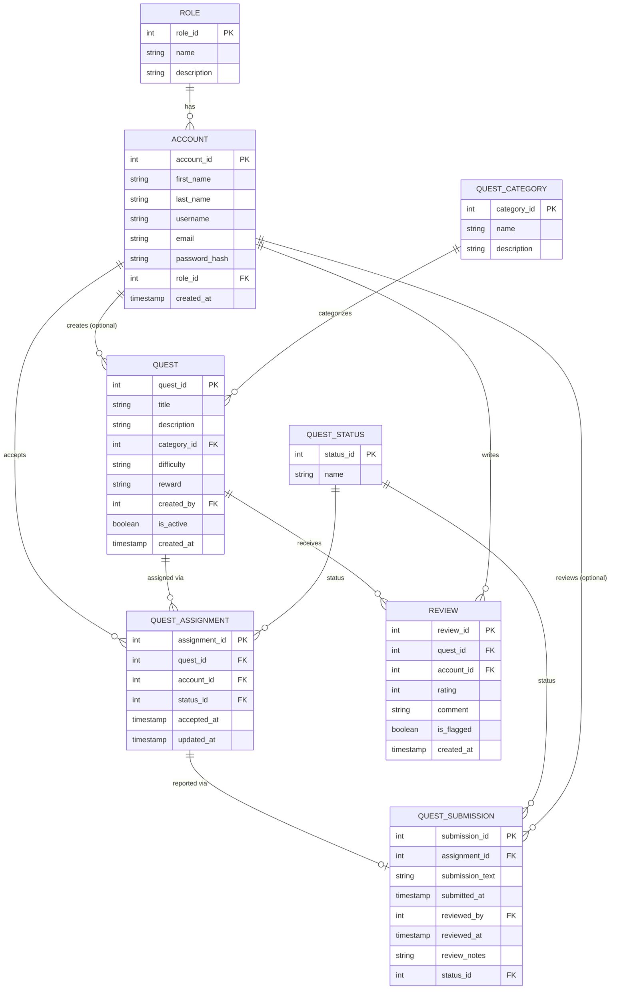

# Hyrule Quest Board

## 1. Project Description

Hyrule Quest Board is a Zelda-inspired web application that allows users to browse, accept, and complete quests throughout the kingdom of Hyrule. Users can track quest progress through multiple stages, submit completion reports, and interact with other users through reviews and comments.

The site is designed for fans of The Legend of Zelda and serves as a demonstration of backend web development concepts including authentication, database design, workflow management, role-based authorization, and dynamic content rendering.

---

## 2. Database Schema

---

## 3. User Roles

### Hero (Standard User)
Heroes are regular users of the site.

Permissions:
- Register and log in
- Browse available quests
- Accept quests
- Submit quest completion reports
- View quest history
- Create, edit, and delete their own reviews

### Guild Officer (Secondary Role)
Guild Officers assist in managing quest activity.

Permissions:
- Review submitted quest reports
- Approve or reject quest completions
- Moderate user reviews
- Monitor active quests

### Administrator
Administrators have full control over the system.

Permissions:
- Manage users and roles
- Create, edit, and delete quests
- Manage quest categories
- Moderate content
- View site statistics
- Access the administrative dashboard

---

## 4. Test Account Credentials

All accounts use a test password

| Role | Username | Email |
|-------|----------|-------|
| Administrator | admin | admin@hyrulequestboard.com |
| Guild Officer | officer | officer@hyrulequestboard.com |
| Hero | hero | hero@hyrulequestboard.com |

---

## 5. Known Limitations

Current limitations and planned improvements:

- Heroes cannot yet rate or review a quest after completing it (the `review` table exists, but there's no UI for it yet).
- The public Quests page has no filtering or sorting options.
- There is no password reset ("forgot password") flow.
- No automated test suite yet.

---

## Technologies Used

- Node.js
- Express
- PostgreSQL
- pgAdmin
- EJS
- Express Session (session store backed by PostgreSQL via `connect-pg-simple`)
- bcrypt (password hashing)
- express-validator (form validation)
- HTML
- CSS
- JavaScript
